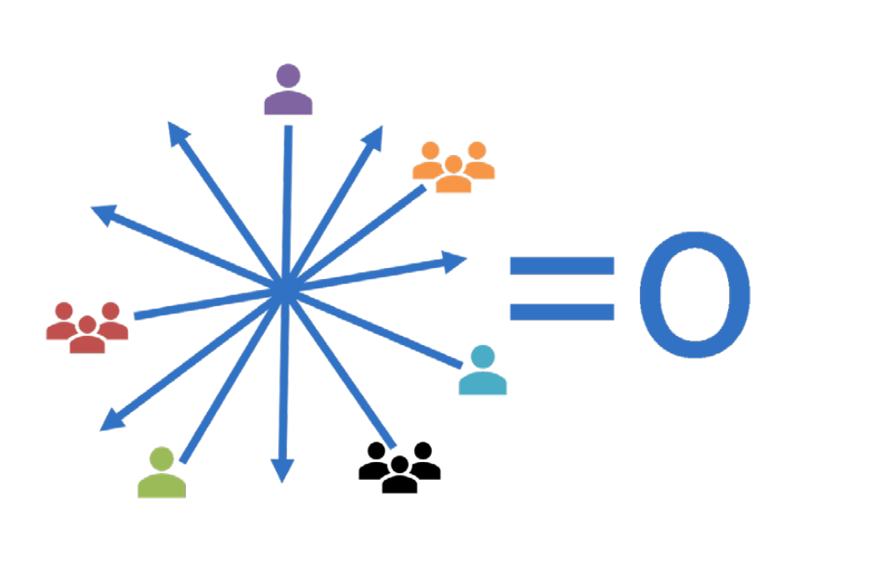

## 🚧 Lack of Alignment Impedes Progress 🚧

Organizations often face significant challenges when teams and stakeholders pursue differing goals without proper alignment. This lack of synchronization can severely hinder progress. Here's an overview of the key issues and solutions:  

### ⚔️ Conflicting Objectives  
- **Development Teams**: Focus on speed and innovation.  
- **Operations Teams**: Prioritize stability and risk minimization.  
- **Business Units**: Target broader organizational goals.  

When these objectives are not aligned, teams may work at cross-purposes, creating friction and inefficiencies.  

---

### 🔄 Cancelling Efforts  
Teams working in silos or without shared goals often:  
- Duplicate efforts.  
- Inadvertently counteract each other's work.  
- Waste resources, leading to reduced progress.  

---

### 😓 Perceived Stagnation  
Misalignment results in:  
- A flurry of activity without tangible outcomes.  
- Frustration among team members.  
- Decreased morale across the organization.  

---

### 🛠️ The Criticality of Alignment  
Alignment is a **cornerstone of DevOps practices**. By focusing on shared objectives, organizations can:  
1. 🗣️ Improve communication.  
2. 📊 Set clear priorities.  
3. 🚀 Eliminate bottlenecks.  
4. ⏩ Accelerate value delivery.  

---

🌟 **Takeaway**: Achieving alignment is essential for fostering collaboration, maximizing efficiency, and driving meaningful progress. DevOps practices offer a proven framework to bridge the gaps between teams and ensure success.  
